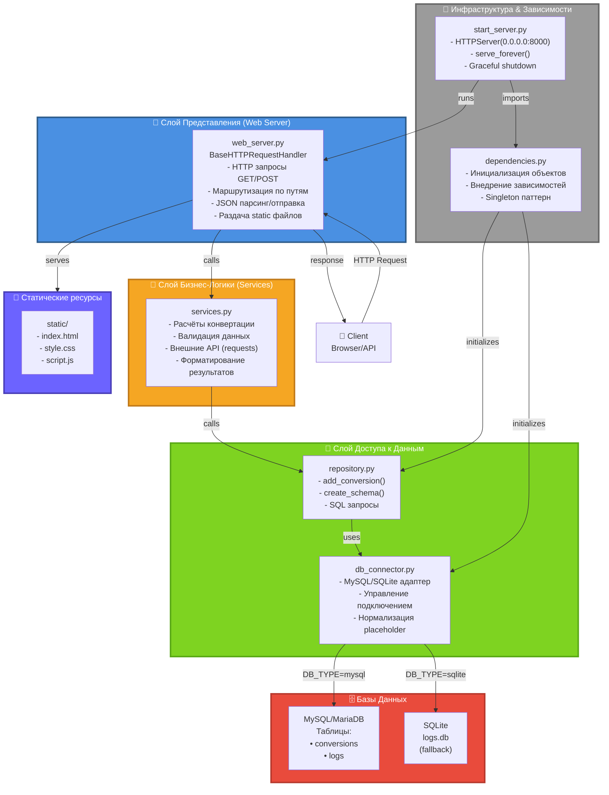

# 🏛️ АРХИТЕКТУРА - Многослойная система приложения



## 📐 Архитектурный паттерн: **Многослойная архитектура (Layered Architecture)**

### Слои приложения:

#### 1️⃣ **Слой Представления** (Presentation Layer)
- **Файл:** `web_server.py`
- **Ответственность:**
  - Приём HTTP запросов
  - Парсинг JSON-тела запроса
  - Маршрутизация (определение какой endpoint вызвать)
  - Отправка JSON ответов
  - Раздача статических файлов (HTML/CSS/JS)
- **Ограничение:** Не содержит бизнес-логику, не знает о БД

#### 2️⃣ **Слой Бизнес-Логики** (Business Logic Layer)
- **Файл:** `services.py`
- **Ответственность:**
  - Расчёты конвертации валют
  - Валидация входных параметров
  - Работа с внешними API (requests)
  - Форматирование данных (isoformat, рounding)
- **Ограничение:** Не знает о HTTP, работает только с Python объектами

#### 3️⃣ **Слой Доступа к Данным** (Data Access Layer)
- **Файлы:** `data/db_connector.py`, `data/repository.py`
- **Ответственность:**
  - Абстракция подключения к БД (MySQL или SQLite)
  - SQL запросы (INSERT, SELECT)
  - Сохранение истории и логов
  - Управление транзакциями
- **Ограничение:** Не принимает решений, только исполняет команды

#### 4️⃣ **Инфраструктура** (Infrastructure)
- **Файлы:** `dependencies.py`, `start_server.py`, `logger.py`
- **Ответственность:**
  - Инициализация объектов (DBConnector, Repository)
  - Конфигурация логирования
  - Запуск HTTP сервера
  - Управление жизненным циклом приложения

---

## 🔄 Поток данных (Data Flow):

```
Client HTTP Request
    ↓
web_server.py (парсинг, маршрутизация)
    ↓
services.py (бизнес-логика, расчёты)
    ↓
repository.py (подготовка SQL)
    ↓
db_connector.py (выбор БД, адаптация)
    ↓
MySQL/MariaDB или SQLite (сохранение)
    ↓
(обратный путь)
web_server.py (JSON ответ)
    ↓
Client
```

---

## ✅ Преимущества этой архитектуры:

| Сценарий | Решение |
|----------|---------|
| **Смена БД** (MySQL → PostgreSQL) | Переписать только `db_connector.py` |
| **Новый интерфейс** (Telegram бот) | Создать новый handler, вызвать `services.py` |
| **Баг в расчётах** | Исправить в одном месте — `services.py` |
| **Изменение дизайна** | Редактировать `static/` |
| **Добавить кэширование** | Добавить слой между `web_server` и `services` |
| **Написать тесты** | Тестировать каждый слой независимо |

---

## 🚀 Итог:

Это **распределённая монолитная архитектура** с чётким разделением ответственности:
- ✅ Легко тестировать каждый слой отдельно
- ✅ Легко добавлять новые возможности
- ✅ Легко менять реализацию (БД, фреймворк, интерфейс)
- ✅ Легко нанимать новых разработчиков (структура понятна)
- ⚠️ Может стать узким местом при масштабировании (используй микросервисы)

**Следующий шаг:** Разделить на микросервисы, если система станет слишком большой.
