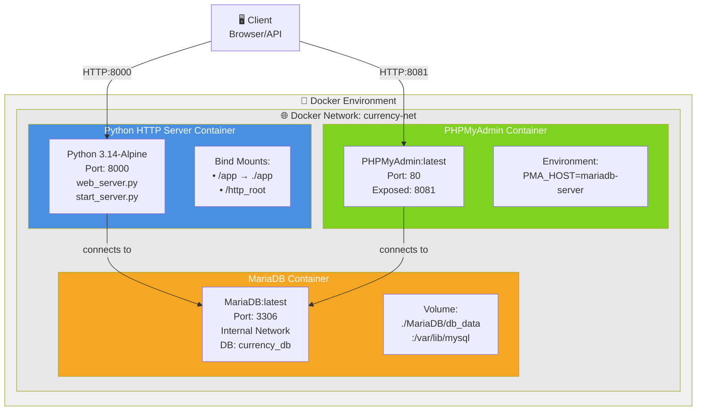

# 🏗️ ИНФРАСТРУКТУРА - Распределённая система контейнеров



## 📋 Компоненты инфраструктуры:

| Компонент | Образ | Порт | Функция |
|-----------|--------|------|----------|
| **Python App** | `python:3.14-alpine` | 8000 | HTTP сервер конвертера валют |
| **MariaDB** | `mariadb:latest` | 3306 (сеть) | Хранилище логов и истории конвертаций |
| **PHPMyAdmin** | `phpmyadmin:latest` | 8081 | Веб-интерфейс управления БД |

## 🔗 Сетевая топология:

- **Сеть:** `currency-net` (Docker bridge network)
- Контейнеры видят друг друга по имени хоста
- Изоляция от хоста (кроме пробросанных портов)

## 📦 Управление инфраструктурой (MG_scripts):

```
load_env.sh          → загружает .env переменные
build_app.sh         → docker build Python образа
build_db.sh          → docker build MariaDB + PHPMyAdmin
run_app.sh           → запуск контейнера приложения
run_db.sh            → запуск сети + MariaDB + PHPMyAdmin
```

## 🌍 Переменные окружения (.env):

```
SUBNET=currency-net
DB_HOST=mariadb-server
DB_NAME=currency_db
DB_USER=app_user
DB_PASSWORD=app_password
PY_APP_PORT=8002
PMA_PORT=8081
```

## 📍 Точки подключения:

- **Python API:** `http://localhost:8000`
- **PHPMyAdmin:** `http://localhost:8081`
- **MariaDB CLI:** `localhost:3306` (только внутри сети)
